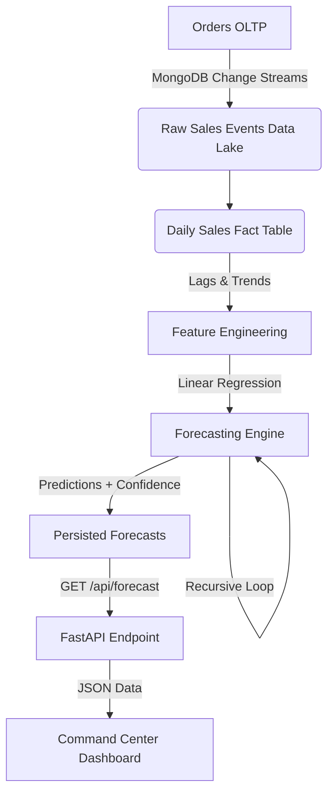

# 🧠 Intelligent Supply Chain / Inventory Command Center


> **A microservices-based inventory analytics platform that separates real-time operations from analytical and forecasting workloads.**


---

## 📖 Overview

The **Intelligent Supply Chain Command Center** mirrors real-world enterprise inventory architectures. It solves the common problem of running heavy analytical queries on operational databases by using **event-driven design**, **data warehousing**, and **explainable machine learning principles**.

The system is designed to ensure that heavy analytical workloads (like training ML models) never block real-time user actions (like placing orders).

---

## 🏗️ System Architecture

The system follows a **Microservices** pattern with two distinct services sharing a data layer, fully orchestrated via Docker.

| Service | Technology | Responsibility |
| :--- | :--- | :--- |
| **Service A (Operational)** | Node.js + Express | Handles high-throughput CRUD (Orders, Products), Auth, and Real-time WebSockets. |
| **Service B (Analytics)** | Python + FastAPI | Listens to data changes asynchronously to retrain models and generate forecasts. |
| **Infrastructure** | Docker Compose | Orchestrates services with internal networking and environment injection. |
| **Database** | MongoDB Atlas | Shared persistence layer with logical OLTP / OLAP separation. |

---

## ✅ Key Features & Implementation Status

### 🟢 Completed (MVP)
* ✔ **Event-Driven Architecture:** Real-time CDC via MongoDB Change Streams.
* ✔ **Immutable Data Lake:** Raw sales events are stored permanently for auditability.
* ✔ **OLAP Aggregation:** Daily aggregated sales fact tables.
* ✔ **Feature Engineering:** ML-ready signal generation (Lags, Rolling Means, Trends).
* ✔ **Forecasting Engine:** Explainable Linear Regression (Phase 4).
* ✔ **Dockerized Backend:** Full containerization of Node.js and Python services.

---

## 🚀 Getting Started

The entire backend infrastructure is containerized. You do not need Node.js or Python installed locally, only Docker.

### 1. Prerequisites
* **Docker Desktop** installed & running.
* A `.env` file in the `infrastructure/` folder containing your `MONGO_URI`.

### 2. Start the System
```bash
cd infrastructure
docker-compose up --build -d
```

### 3. Verify Connectivity
* **Operational API (Node)**: `http://localhost:4000/health`

* **Analytics API (Python)**: `http://localhost:8000/health` (Internal: `http://service-analytics:8000`)

---

## 📊 Deep Dive: Analytics Pipeline

The system uses a sophisticated pipeline to transform raw transactional data into actionable predictions.


**1. Feature Engineering (Phase 3)**

We prioritize "Features over Algorithms." The layer converts business data into explainable signals:

* **Lag Features**: 1, 7, 14 days (Memory & Seasonality).
* **Rolling Mean**: 7-day smoothing (Leakage-safe).
* **Trend Index**: Captures directional momentum.

**2. Forecasting Engine (Phase 4)**

* **Algorithm**: Linear Regression (Scikit-Learn).
* **Strategy**: Recursive Multi-step Forecasting.
* **Training**: On-the-fly per SKU.
* **Confidence**: Dynamic confidence intervals based on R2 scores.

**3. Model Lifecycle**

* **Stateless**: Models are trained on demand; they are not stored.
* **Persistence**: Only the forecast outputs and confidence scores are saved to the database.
* **API**: Forecasts are served via a high-performance read-only endpoint (`GET /api/forecast/{sku}`).

---

## 💻 Tech Stack

### Infrastructure
* Docker & Docker Compose
* MongoDB Atlas (Replica Set + Change Streams)

### Service A (Operational)
* **Runtime**: Node.js
* **Framework**: Express
* **Real-time**: Socket.io
* **ORM**: Mongoose

Service B (Analytics)
* **Runtime**: Python 3.11 (Slim Image)
* **Framework**: FastAPI
* **Async DB**: Motor
* **Data Science**: Pandas, NumPy, Scikit-Learn

---

## 🎯 Project Philosophy

* **Finish MVP cleanly** before adding complexity.
* **Prefer explainable models** over black-box accuracy.
* **Separate** data ingestion, transformation, and prediction clearly.
* **Treat documentation** and architecture as first-class deliverables.

---

> **Status:** MVP Complete (Dockerized Backend)
> **Stack:** Node.js (OLTP), Python (OLAP), MongoDB Atlas, Docker, Socket.io

---

